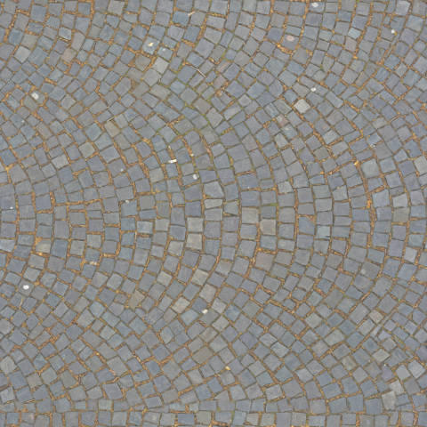
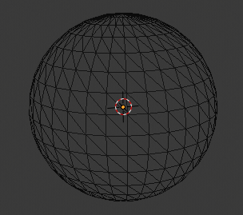
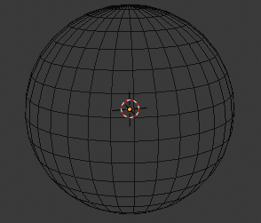

Introducción a los videojuegos
##############################

Cuando se habla de videojuegos, el común de la gente piensa que solo son cosas
de niños, pero cuando nos adentramos en el mundo de la realización de
videojuegos nos encontramos que es todo una industria muy seria y que sigue
procesos y procedimientos muy formales, lo que nos da a entender que ya no
son cosas de niños.

Durante la realización te encontrarás con muchos términos que es necesario
conocer antes de empezar a construir un videojuego. En este capítulo haremos
un glosario de términos con ejemplos y que significa cada uno de ellos.

Estará separado por contextos, tanto para videojuegos 2D como 3D, también
hablaremos de conceptos artísticos como dibujo, gráfica, música y audio.

Terminología 2D
===============

**8-way**: Es la posibilidad que tiene un elemento de pantalla para moverse en
8 direcciones distintas, los teclados normalmente tienen solo 4 flechas de
dirección, y podemos emular este comportamiento haciendo combinaciones de
arriba con derecha e izquierda y también abajo con derecha e izquierda. En los
joystick esto es más natural ya que se mueven en círculos y así pueden
fácilmente representar las 8 direcciones, en cambio los d-pad solo
tienen 4 direcciones y se deben combinar para lograr las 8 direcciones, pero
hay excepciones donde los d-pad podían tener 8 direcciones como el joypad de
**Sega master System**. Actualmente los joypad contienen ambos controladores
d-pad y joystick por lo cual les dá mayor versatilidad.

.. |dpad| image:: https://upload.wikimedia.org/wikipedia/commons/thumb/b/ba/Sega_master_system_d-pad.jpg/220px-Sega_master_system_d-pad.jpg
.. |joypad| image:: https://upload.wikimedia.org/wikipedia/commons/thumb/c/c7/PSX-DualShock-Controller.jpg/220px-PSX-DualShock-Controller.jpg

+------------------------+
| |dpad|                 |
+------------------------+
| Este es un control de  |
| **Sega master System** |
+------------------------+

+-------------------+
| |joypad|          |
+-------------------+
| joypad de PS2 con |
| ambos controles   |
+-------------------+

**Canvas**: Este término en inglés significa en español lienzo. En
videojuegos un **canvas** es el área donde la GPU dibuja todo el
contenido del videojuego, también existe la posibilidad de dibujar
en varias capas, a cada una de estas se les llama **Canvas layer**.
Usar varias capas te dá la posibilidad de hacer el efecto
**Parallax Background**.

**Parallax Background**: Es una técnica muy ocupada por muchos juegos
de plataformas para dar un efecto de profundidad. también se le suele
llamar **Scroll Parallax** o **Parallax Scrolling** dado que es el
comportamiento típico en juegos de plataformas. Uno de los primeros
videojuegos que adoptó esta técnica fue **Moon Patrol** (1982)

.. raw:: html

    <table border="1" class="docutils">
        <tr class="row-odd">
            <th>
                <iframe width="100%" height="315"
                src="https://www.youtube.com/embed/6EptD9Egf7w"
                frameborder="0"></iframe>
            </th>
        </tr>
        <tr class="row-even">
            <td>Videojuego <strong>Moon Patrol</strong> 1982</td>
        </tr>
    </table>

**Pixel**: Representación de un punto en una pantalla, este puede ser uno de
los 16.777.216 colores posibles, comúnmente se separan en 3 canales de colores
Rojo, Verde y Azul; también se le conoce como RGB por sus siglas en ingles
(Red, Green, Blue) si ves una TV muy de cerca, podrás notar unos pequeños
puntos de luz y cada uno de ellos tiene uno de estos 3 colores, dependiendo
de la intensidad de luz que emitan que va desde 0 (Negro) a 255 (Blanco) y
mezclando los 3 canales dá el efecto de que estamos viendo un solo color.
dependiendo de la resolución máxima que pueda tener una pantalla estos puntos
de luz serán más pequeños, logrando asi un **pixel** de mayor definición de
imagen. La unidad de medida en que se miden los **pixeles** es en **dpi**
que es la sigla en ingles para "dot per inch" o en español
"puntos por pulgadas", es decir, es la cantidad de puntos que pueden caer en la
distancia de una pulgada o 2.54 centímetros. Mientras más puntos quepan en
una pulgada mayor definición de pixel tendrá la imagen, asi que esta medida
mientra más alta es mejor.

.. |pixel| image:: https://upload.wikimedia.org/wikipedia/commons/thumb/4/4d/Pixel_geometry_01_Pengo.jpg/200px-Pixel_geometry_01_Pengo.jpg

+----------------+
| |pixel|        |
+----------------+
| **Pixeles** de |
| una pantalla   |
+----------------+

**PixelArt**: Esta es una técnica ocupada por muchos videojuegos al inicio de
la era de los videojuegos, donde los elementos en pantalla eran dibujado
mediante pixeles, permitiendo asi darle forma a los personajes, escenarios y
enemigos. Conforme avanzó la tecnología gráfica de las computadoras ya no fue
necesario seguir dibujando pixeles por medio de computación sino que se
empezaron a usar formatos de imágenes, permitiendo asi lograr una mejor calidad
visual en los videojuegos. Pero los amantes de los gráficos generados por pixel
quisieron rescatar este estilo y empezar a hacer imágenes que su construcción
es a base de puntos de colores y lograr verdaderas fotografías a base de
puntos, luego se adoptó este mismo estilo para volver a los juegos retros que
hoy en día están muy de moda.

.. |pixelart| image:: https://upload.wikimedia.org/wikipedia/commons/8/8f/Pixel-Art_Wohnhaus_Nr._6.gif

+--------------+
| |pixelart|   |
+--------------+
| Un gráfico   |
| **Pixelart** |
+--------------+

**Sprite**: Es un pequeño gráfico que puede representar una pose de un
personaje, un objeto estático del videojuego, una pequeña porción gráfica
para generar un nivel completo como si este fuese un rompecabezas, etc...
todos aquellos elementos gráficos en un videojuego les podemos llamar
sprite. Los sprites pueden ser trasparentes o usar un color de fondo como
color de transparencia, comúnmente ocupan el **magenta**, porque es un color
poco natural, también se pueden encontrar sprites con fondo **verde** para
usarlo también como color de transparencia. La norma para crear un sprite
es que sus dimensiones estén en potencia de 2 pixeles, es decir, tamaños de
16x16, 32x32, 64x64, 32x64, 64x128, etc... Un tamaño de sprite mal creado,
tanto para su ancho o alto no estaría en potencia de 2 pixeles, aunque de
todas formas lo puedes usar como sprite, sugiere una perdida de rendimiento
en un videojuego el cargar en la GPU estos sprites.

.. |sprite| image:: https://upload.wikimedia.org/wikipedia/commons/a/a4/Sprite_example_neoriceisgood.png

+----------------+
| |sprite|       |
+----------------+
| Un Conjunto    |
| de **Sprites** |
+----------------+

**Sprite Sheet**: Es una colección de **sprites** que pueden representar las
poses de uno o varios personajes y tener también objetos inanimados o
elementos de nivel. Es muy útil para no tener que cargar en memoria varias
imágenes sino solo leer una gran imagen en memoria, para asegurar una carga
mas eficiente del videojuego.

.. |ssheet| image:: https://upload.wikimedia.org/wikipedia/commons/6/68/BOE_tile_set.png

+----------------------+
| |ssheet|             |
+----------------------+
| Un **Sprites Sheet** |
+----------------------+

**Tile**: Es una representación de un elemento de nivel, normalmente
se obtienen desde un **Sprite Sheet**, permite generar muchos niveles
solamente juntando los como si fuesen un rompecabezas, es una técnica
muy práctica para generar niveles con poco esfuerzo, solo pintando en
pantalla como si estos fuesen pinceles con la forma de un **sprite**.

**Tiles automaticos (Autotile)**: Es una técnica que se ocupa para poder
dibujar un conjunto de tiles y que estos automáticamente completen las
tiles faltantes, permitiendo acelerar el proceso de construcción de un
nivel de videojuegos, se configuran qué tiles se usaran como esquinas,
qué esquina representara cada tile, y cuales tiles representan el centro,
como por ejemplo, si queremos dibujar un lago, solo dibujamos el contorno
con los tiles del borde del lago, y al cerrar la forma del contorno el
**autotile** rellenará los espacios del centro con el tile de agua. Con
**autotile** puedes generar niveles muy rápidos.

**Tilemap**: Es el área que ocupamos para ir dibujando nuestro nivel de
videojuego usando los **tiles**.

**Tileset**: Son un conjunto de tiles destinados a formar las partes de
un nivel de videojuego.

.. |tile| image:: https://docs.godotengine.org/es/latest/_images/tile_example6.png

+------------------+
| |tile|           |
+------------------+
| A la izquierda   |
| un **TilesSet**, |
| en el centro un  |
| **Tilemap** en   |
| progreso.        |
+------------------+

Terminología 3D
===============

**Albedo**: Es el porcentaje de radiación que cualquier superficie refleja
respecto a la radiación que incide sobre ella.

Esta definición no lo deja muy claro, en videojuegos un pixel emite un color
y dependiendo de la cantidad de luz que incida en la superficie tendrá cierta
intensidad, a esto le podemos denominar "la radiación que se refleja". la luz
también puede tener un color que se mezcla con el color de los pixeles de una
imagen, el resultado final es otro color tintado por la luz que ha incidido.
El grado de incidencia de la luz también depende de la geometría del objeto y
como esta desplegado en el su mapa UV. Normalmente se usa una imagen cualquiera
que representa la superficie de un objeto, pero el tamaño de la imagen debe
respetar la norma de la potencia de 2 pixeles.

+-------------+
| |texture|   |
+-------------+
| Imagen para |
| usar como   |
| **Albeado** |
+-------------+

**Ambient Occlusion**: También abreviado como AO por sus siglas, que en español
significa Oclusión ambiental. Son las áreas donde la luz no logra llegar, ya
sea porque está fuera del área de luz o porque se interpuso una sombra, estas
son iluminadas por la luz ambiental.

.. |ao| image:: https://docs.godotengine.org/en/3.1/_images/environment_ssao2.png

+----------+
| |ao|     |
+----------+
| **AO**   |
| aplicado |
+----------+

**Anisotropy**: o también en español Anisotropía, es la cualidad que tiene la
luz de propagarse a cierta velocidad dependiendo desde el punto de observación.
En videojuegos se utiliza para mejorar la calidad de una imagen respecto al
angulo que esta se está mirando, cuando el angulo es muy oblicuo a la imagen
suele distorsionarse y verse pixelada, con esta técnica se podría evitar ese
efecto.

.. |anis| image:: https://upload.wikimedia.org/wikipedia/commons/thumb/d/dc/MipMap_Example_STS101_Anisotropic.png/256px-MipMap_Example_STS101_Anisotropic.png

+------------------+
| |anis|           |
+------------------+
| Representación   |
| de la corrección |
| de anisotropía   |
+------------------+

**Arista**: Es una línea que une 2 puntos en el espacio.

**Baked lightmaps**: Es una técnica de computación de gráficos ocupada para
generar el efecto de **Oclusión ambiental**. Usada en GPUs más antiguas.

**Baking Lights**: Una técnica mejorada de **Baked lightmaps** para generar el
efecto de **Oclusión ambiental**. Usada en GPU más modernas.

**Billboard**: Es una técnica ocupada para que una cara de un objeto siempre
mire de frente a la cámara. esta técnica fue muy usada en juegos como **DOOM**,
para hacer que los enemigos siempre te miraran de frente y por mas que los
rodearas, haciendo parecer que eran elementos 3D pero que finalmente era
planos.

**Blend**: Esto es un modo que permite mezclar los pixeles de varias texturas
logrando un efecto mas detallado y realista.

**Cara**: Es el área que se rellena juntando 3 o más aristas.

**Clearcoat**: Es un efecto que se le puede dar a una superficie para que
parezca que está recubierta por una capa trasparente, como la pintura de
un automóvil o una bola de billar.

.. |clearcoat| image:: https://cdn.pixabay.com/photo/2018/12/27/03/38/billiards-3896912_960_720.jpg

+----------------+
| |clearcoat|    |
+----------------+
| Bola de billar |
| mostrando este |
| Efecto         |
+----------------+

**Collada**: Es un formato del archivo de intercambio para modelos 3D,
este puede contener adicionalmente animaciones, estructura de huesos,
materiales, etc..., es un formato tan extendido que puede ser utilizado
en cualquier software de modelado 3D, motores de videojuegos y aplicaciones
que usan 3D para representar elementos.

**Color Difuso**: Es la reflexion de la luz en una superficie de un objeto. Al
igual que **Albeado** cumple la misma función.

**Coordenada Z**: Es aquella que nos permite tener un mundo 3D normalmente la
que nos permite tener profundidad, y ver objetos más lejanos y otros cercanos.
En un mundo 2D solo existen 2 coordenadas X e Y, que reresentan el ancho y el
alto respectivamente, agregand esta coordenada podemos ya no solo movernos de
izquierda a derecha, y de arriba hacia abajo, sino que tambien hacia el fondo
y hacia atras.

**CSG**: Siglas en ingles de **Constructive Solid Geometry**, que en español
significa Geometría sólida constructiva. permite construir la geometría de un
objeto mediante la intersección de uno o más objetos aplicando una estrategia
de mezclado, ya sea añadiendo o eliminando un trozo de aquellas partes que no
se unen.

.. |csg| image:: https://docs.godotengine.org/en/3.1/_images/csg.gif

+-----------+
| |csg|     |
+-----------+
| Aplicando |
| **CSG**   |
+-----------+

**Cull**: permite evitar se dibujen las caras de un objeto que no estan siendo
visibles, por lo general siempre es la cara tracera. de un objeto.

**DCC**: siglas en ingles de **Digital content creation**, que en español
significa **Creación de contenido digital**, normalmente se les denomina
asi a los softwares que permiten la creación de este contenido como
herramientas de modelado 3D.

**Depth Draw**: Es un modo que permite el dibujado de la profundidad del objeto
y representarlo como geometría en donde la luz podría proyectar sombras.

**Displacement**: Permite dar un efecto de profundidad en un objeto que en su
textura representa cabidades, haciendo que se vea más realista.

**Emission**: Es la posibilidad que se le puede dar a un objeto para emita
luz, este debe ser usado junto a **Baking Lights** para que la luz emitida
sea trasmitida a los objetos al su alrededor.

.. |emission| image:: https://docs.godotengine.org/en/3.1/_images/spatial_material15.png

+--------------+
| |emission|   |
+--------------+
| Objeto con   |
| **Emission** |
| a la derecha |
+--------------+

**Energía de la luz**: Es la intencidad de la luz que se genera desde alguna
fuente fija o luz ambiental, su unidad de medida es el Watt.

**Luz indirecta**: es a luz que se refleja de forma indirecta a los
objetos, por medio de la luz que rebota de los objetos en los cuales incide la
luz.

.. |indirect| image:: https://docs.godotengine.org/en/3.1/_images/giprobe_indirect.png

+---------------+
| |indirect|    |
+---------------+
| Comparación   |
| de una imagen |
| con luz       |
| directa y con |
| luz Indirecta |
+---------------+

**Entorno**: Describe varios aspectos de como se verá nuestro videojuego, es
totalmente configurable y podemos ajustar las siguentes propiedades:

* **Fondo**:

  * **Cielo**: Color general y color del horizonte.
  * **Suelo**: Color general y color del horizonte.
  * **Sol**: Posición, angulo y energía.

* **Luz ambiental**: Color y energía.
* **Niebla (FOG)**: Rango de niebla con respecto a la cámara.

**Especular**: Es la forma en que una superficie refleja la luz.

**Blur**: Es un efecto que permite desenfocar una escena, permitiendo configurar, el
desenfoque de cerca y el desonfoque de lejos

.. |fblur| image:: https://docs.godotengine.org/en/3.1/_images/environment_dof_far.png
.. |nblur| image:: https://docs.godotengine.org/en/3.1/_images/environment_dof_near.png

+------------+
| |fblur|    |
+------------+
| Desenfoque |
| **lejano** |
+------------+

+------------+
| |nblur|    |
+------------+
| Desenfoque |
| **cercano**|
+------------+

**Fog**: El efecto FOG permite realizar varias cosas, principalmente una
ambientación con niebla, pero también se usa para que objetos lejanos dejen de
verse en detalle, y se vea solamente su silueta detras de la niebla, logrando
con esto un mejor rendimiento en la escena 3D.

**Geometría**: Todo objeto 3D está construido por medio de poligonos, el
conjunto de estos poligonos que forman el objeto se le llama geometría.

**GI Probes**: En una técnica ocupada para generar luz indirecta en tiempo real
haciendo que la luz se comporte de acuerdo al punto de visa de una camara y que
se vea de una forma más real.

**Gridmaps**: Es una técnica empleada en el diseño de niveles 3D, que por medio
de objetos tridimencionales se van colocando en pantalla como si estos fueran
tiles 2D.

**Grow**: Es un efecto que permite separar las caras de un objeto unidas por
sus aristas.

.. |grow| image:: https://docs.godotengine.org/es/latest/_images/spatial_material10.png

+---------+
| |grow|  |
+---------+
|Aplicando|
|**Grow** |
+---------+

**LOD**: Level of Detail por sus siglas en ingles, que en español significa
**Nivel de Detalle**, es una técnica usada para hacer que los objetos más
lejanos tengan menos definición de su geometría, mientras que los objetos
mas cercanos se definen a mayor calidad.

**Luz Direccional**: Es un tipo de luz que simula ser un sol.

.. |dirl| image:: https://docs.godotengine.org/en/3.1/_images/shadow_blocky.png

+-----------------+
| |dirl|          |
+-----------------+
| Luz             |
| **Direccional** |
+-----------------+

**Luz Omni-direccional**: Es una luz que permite proyectar su luz en un radio
y con una intensidad definida, es mas parecido a como ilumina una ampolleta.

.. |omnil| image:: https://docs.godotengine.org/en/3.1/_images/light_omni.png

+----------------------+
| |omnil|              |
+----------------------+
| Luz                  |
| **Omni Direccional** |
+----------------------+

**Luz Spot**: Es una luz que permite desplegar la luz como un cono, es más
parecida a la luz de un foco de un automovil o un foco de vigilancia.

.. |spotl| image:: https://docs.godotengine.org/en/3.1/_images/light_spot.png

+----------+
| |spotl|  |
+----------+
| Luz      |
| **Spot** |
+----------+

**Mapa UV**: Sirve para poder proyectar adecuadamente una imagen sobre una
superficie tridimencional, esta se despliega como una malla en 2 dimensiones.
En ella podemos colocar una imagen y automáticamente el **Mapa UV** por medio
de sus cordenadas referencia esa imagen y la despliega sobre el objeto 3D,
envolviendolo como si el objeto tubiese esa textura.

.. |uv| image:: https://upload.wikimedia.org/wikipedia/commons/thumb/f/fe/Cube_Representative_UV_Unwrapping.png/1024px-Cube_Representative_UV_Unwrapping.png

+------------+
| |uv|       |
+------------+
| **Mapa UV**|
| proyectado |
+------------+

**Material**: Se compone de varios elementos como: Albeado o Color Difuso, 
que tan metálico es, su rugosidad, la cantidad de Especularidad, El mapa UV,
el nivel de Ocusion ambiental, entre otras propiedades.

.. |material| image:: https://docs.blender.org/manual/en/dev/_images/render_cycles_nodes_types_shaders_principled_example-1a.jpg

+------------+
| |material| |
+------------+
| Lista de   |
| Materiales |
+------------+

**Mesh**: Es una malla que da forma a un objeto 3D, esta se compone por
vertices y aristas. También se le conoce como malla poligonal ya que se forma
de distintos poligonos.

.. |mesh| image:: https://upload.wikimedia.org/wikipedia/commons/f/fb/Dolphin_triangle_mesh.png

+-----------+
| |mesh|    |
+-----------+
| Una malla |
| de delfin |
+-----------+

**MeshLibrary**: Es una colección de **Mesh** para usarlas en un **Gridmap**

**Metallic**: Es la pripiedad que tiene un material de ser más o menos
metálico.

.. |metal| image:: http://res.publicdomainfiles.com/pdf_view/67/13925311812550.png

+----------+
| |metal|  |
+----------+
| Esfera   |
| Metálica |
+----------+

**Normalmap**: También llamado mapa de normales, permite darle un efecto de
relieve a una material, usando la luz y el punto de vista como referencia.

.. |normal| image:: https://learnopengl.com/img/advanced-lighting/normal_mapping_normal_map.png

+------------+
| |normal|   |
+------------+
| Una imagen |
| de mapa de |
| normales   |
+------------+

**OBJ**: Formato de archivo extensamente soportado por todos los DCC, permite
almacenar la malla de un objeto y los materiales asociados a el, util para
objetos estaticos.

**Origen**: Es un punto virtual en la malla de un objeto que define su centro
de rotación, normalmente se coloca en el centro del objeto, pero muchas veces
es preferible colocarlo en la base del objeto, util en este caso para
personajes, cuando importas un objeto en un programa de edición 3D, toma este
punto para posicionar el objeto en el centro de la escena.

**PBR**: Es una técnica de creación de materiales permite mediante un conjunto
de imagenes usadas como textura, mapa de normales, rugocidad, oclusión
ambiental, entre otros ajustes para obtener objetos relistas, usando el rebote
de la luz y el punto de vista para lograr el efecto.

**Plano**: Es una figura sin volumen de 2 dimensiones, útil para representa el
suelo en un entorno 3D.

**Polígono**: Es una estructura que se forma por 3 o más **aristas**. su nombre
proviene por 2 palabras: poli, que significa varios, y gono: que significa
angulo, es decir una figura geometrica de 2 o mas angulos, es decir, para formar
2 o más angulos se requieren 3 o más **aristas** unidas. Un triangulo es un 
polígono ya que tiene 3 **aristas** y 2 angulos.

**Quaternions**: Son polígonos compustos por 4 **aristas**, tambien llamados
**Quads**. En la era naciente del 3D se solian usar triangulos para generar
objetos 3D, esto quiere decir que para generar un cubo se requerian 12
poligonos, luego con la mejora de la tecnología se incorporaron los 
**Quaternions** permitiendo hacer mallas más complejas y reducir la cantidad de
poligonos con un rendimiento más eficiente, esto se traduce en objetos de mayor
definición y velocidad de cálculo de mallas.

+------------+
| |3dold|    |
+------------+
| Una malla  |
| Formada    |
| por        |
| triangulos |
| (960 caras)|
+------------+

+------------+
| |3dnew|    |
+------------+
| Una malla  |
| Formada    |
| por        |
| **Quads**  |
| (512 caras)|
+------------+

**Refracción**: Es la propiedad que tienen un material de desviar la luz,
en una superficie la luz rebota según su normal, la normal es la dirección
que toma la luz que rebota.

.. |refract| image:: https://docs.godotengine.org/en/3.1/_images/spatial_material23.png

+----------------+
| |refract|      |
+----------------+
| Efecto         |
| **Refracción** |
| a la derecha   |
+----------------+

**Render**: Es un proceso de calculo que hace una GPU para representar un
entorno 3D mezclando la luz ambiental los materiales y la posicion de del punto
de vista, dando como resultado una imagen de alta resolución y realismo.
Usado extensamente en la produccion de peliculas animadas.

**Rim**: Es la propiedad de un material para parecer una telas que tienen una pequeña
microfibra, y hace que la luz se esparza a su alrededor.

.. |rim| image:: https://docs.godotengine.org/en/3.1/_images/spatial_material17.png

+--------------+
| |rim|        |
+--------------+
| Efecto       |
| **Rim**      |
| a la derecha |
+--------------+

**Roughness**: Es la característica que tiene un material de ser mas o menos
rugos, evitando que la luz sea refractada o disminuyendo su intencidad.

**Spatial**: Se le denomina a cualquier objeto que sea representado un entorno
3D.

**Subsurface Scattering**: Es la propiedad que tiene un material de poder
absorber luz hacia el interior de un objeto y luego proyectarla hacia afuera de
él. logrando un mayor realizmo, como por ejemplo la luz del sol que absorbe la
piel humana.

.. |sss| image:: https://docs.godotengine.org/en/3.1/_images/spatial_material21.png

+---------------+
| |sss|         |
+---------------+
| Efecto        |
| **Subsurface**|
| **Scattering**|
| a la derecha  |
+---------------+

**Surface**: Superficie de un material.

**Textura**: Imagen usada como superficie de in material, que puede ser una
imagen que reprente su aspecto.

**TextureAtlas**: Es una imagen que contiene varias texturas, normal
mente usado para objetos que usan distintos materiales, como por ejemplo
personajes de videojuegos que visten de variadas formas.

**Transform**: Son las propiedades de un objeto 3D que definen su posición,
rotación y tamaño.

**Transmisión**: Es la cantidad de luz del lado iluminado que se transfiere al
lado oscuro (opuesto a la luz). Esto funciona bien para objetos delgados como
hojas de plantas, hierba, oídos humanos, etc.

.. |trans| image:: https://docs.godotengine.org/en/3.1/_images/spatial_material22.png

+-----------------+
| |trans|         |
+-----------------+
| Efecto          |
| **Transmisión** |
| a la derecha    |
+-----------------+

**Vértice**: Corresponde a un punto de una malla que une 2 o más **aristas**.

**World**: Es el lugar donde se colocan los objetos 3D, que se requieren
representar en pantalla.

Terminología 2D y 3D
====================

Cámara
Colisión
Coordenadas Globales y locales
Cuerpo Blando (Soft)
Cuerpo Cinemático (Kinematic)
Cuerpo Estático (Static)
Cuerpo Rígido (Rigid)
delta
Escala
Escena
FPS
Gizmos

**GPU**: Graphics Processor Unit por sus siglas en ingles que significa en
español **Unidad de procesamiento gráfico**, es la encargada de procesar los
graficos 2D y 3D de una computadora. es una Unidad de procesamiento dedicada 
a esta tarea.

GUI
HUD
Input
InputMap
Internacionalización
Luces
Maquina de estados
Normalización
Oclusión
OCS (Coordenadas)
Ortogonal
Partículas
Producto Cruz
Producto Punto
Ragdoll
Ray-Casting
Reflexión
Rotación
Señales
Shaders
Sombras
Traslación
Vector
Viewport

Terminología de Animación
=========================

Cutout
Hueso
IK
Keyframe
Loop
Paint Weight
Pose
Rigging
Root motion
Skeleton
Timeline
Track

Terminología para Dibujo
========================

Terminología Gráfica
====================

Exposición
Gradient
HDR
PCF13
RGB
Smooth

Terminología Musical
====================

Acorde
Compás
Escala
Intervalo
Nota
Partitura
Pulso
Quinta
Ritmo
Tonalidad

Terminología para Audio
=======================

Amplificar
Audio Stream
Bandas
Bus de audio
Canal
Chorus
Compresor
Decibel
Delay
Distorsión
Doppler
EQ10
EQ21
EQ6
Estéreo
HighPassFilter
HighShelfFilter
Limiter
LowPassFilter
LowShelfFilter
Monoaural
NotchFilter
Panner
Phaser
PitchShift
Playback
Reverb

