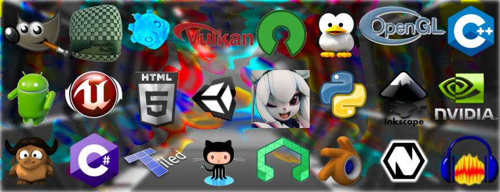

Bienvenido a la documentación de RKiemGames
==========================================

En esta documentación encontrarás todo el contenido de nuestro proceso de
desarrollo de videojuegos, también encontrarás tutoriales que te guiarán en los
procedimientos que se deben realizar para cada proceso.

También publicamos tutoriales de aprendizaje para las distintas materias
relacionadas con la realización de videojuegos, tales como:

* **Programación** para videojuegos.
* **Arte** para videojuegos.
* **Audio y música** para videojuegos.
* **Marketing digital** para videojuegos.

Iremos agregando contenido a medida que vallamos avanzando en los distintos
tópicos.

A continuación se listan los tutoriales correspondientes a las siguientes
categorías:

Programación de videojuegos
###########################

.. toctree::
   :maxdepth: 1

   prog/prog_init_index
   prog/prog_basic_index
   prog/prog_medium_index
   prog/prog_advanced_index

Arte para videojuegos
#####################

.. toctree::
   :maxdepth: 1

   art/art_001

`Próximamente`

Audio y música para videojuegos
###############################

.. toctree::
   :maxdepth: 1

   music/music_001

`Próximamente`

Marketing Digital
#################

.. toctree::
   :maxdepth: 1

   mkt/mkt_init_index

Contenido Adicional
###################

.. toctree::
   :maxdepth: 1

   godot/index
   extra/index

Próximamente agregaremos más contenido, así que quedate al tanto de las
novedades.

Puedes visitar nuestra
`página de facebook RKiemGames <http://facebook.me/RKiemGames>`_ por si
tienes dudas o deseas conversar con nosotros.
